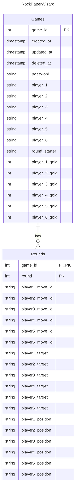

# Planning

## DB design

### Create a New Game

This will happen when user creates a new game.

- enhancement todo: If I dont plan on letting users sign up
  - I need to figure out a way to restrict game creation and perhaps joining based on IP address
- validate playername
- validate password
- validate number_of_players between 2 and 6
- generate a new game_id
- add created_at timestamp
- add updated_at timestamp
- add password
- add player_1 name
- add number_of_players
- based on number of players, set non need player columns to null
- set all player gold to 0

### Client side

-

### Join a Game

This will happen when user joins a game.

- enhancement todo: Same as in game creation, might need to do a IP check

### Start Game

- Setup Round 1
